```mermaid
flowchart TB
    %% ── Styling ──
    classDef agent fill:#4A90D9,stroke:#2C5F8A,color:#fff,stroke-width:2px,rx:10
    classDef tool fill:#F5A623,stroke:#D48A1A,color:#fff,stroke-width:1px,rx:5
    classDef db fill:#7B68EE,stroke:#5A4FCF,color:#fff,stroke-width:2px,rx:3
    classDef input fill:#50C878,stroke:#3A9D5C,color:#fff,stroke-width:2px,rx:8
    classDef output fill:#E74C3C,stroke:#C0392B,color:#fff,stroke-width:2px,rx:8

    %% ── External I/O ──
    CR(["\n Customer Request\n quote_requests_sample.csv\n"]):::input
    RESP(["\n Customer Response\n test_results.csv\n"]):::output

    %% ── Database ──
    DB[("\n SQLite Database\n munder_difflin.db\n\nTables:\n• inventory\n• transactions\n• quotes\n• quote_requests\n")]:::db

    %% ── ORCHESTRATOR AGENT ──
    subgraph ORCH [" ORCHESTRATOR AGENT  (ToolCallingAgent)"]
        direction TB
        O_DESC["Manages the sequential pipeline:\n1 → Inventory  2 → Quoting  3 → Sales  4 → Compose Response\nCustomer-facing: warm, professional, no internal details"]
        O_T1[" search_past_quotes\n↳ search_quote_history()"]:::tool
        O_T2[" check_all_inventory\n↳ get_all_inventory()"]:::tool
    end
    ORCH:::agent

    %% ── INVENTORY AGENT ──
    subgraph INV [" INVENTORY AGENT  (ToolCallingAgent)"]
        direction TB
        I_DESC["Checks stock levels, flags reorder needs,\n estimates supplier delivery, looks up prices"]
        I_T1[" check_all_inventory\n↳ get_all_inventory()"]:::tool
        I_T2[" check_item_stock\n↳ get_stock_level()"]:::tool
        I_T3[" get_delivery_estimate\n↳ get_supplier_delivery_date()"]:::tool
        I_T4[" get_item_unit_price\n↳ DB query on inventory table"]:::tool
    end
    INV:::agent

    %% ── QUOTING AGENT ──
    subgraph QUO [" QUOTING AGENT  (ToolCallingAgent)"]
        direction TB
        Q_DESC["Generates competitive quotes with\n bulk discount tiers:\n100-499 → 5% · 500-999 → 10%\n1000-4999 → 15% · 5000+ → 20%"]
        Q_T1[" search_past_quotes\n↳ search_quote_history()"]:::tool
        Q_T2[" check_item_stock\n↳ get_stock_level()"]:::tool
        Q_T3[" check_all_inventory\n↳ get_all_inventory()"]:::tool
        Q_T4[" get_item_unit_price\n↳ DB query on inventory table"]:::tool
    end
    QUO:::agent

    %% ── SALES AGENT ──
    subgraph SAL [" SALES AGENT  (ToolCallingAgent)"]
        direction TB
        S_DESC["Records each sale transaction,\n verifies stock before selling,\n handles partial fulfillment"]
        S_T1[" record_sale\n↳ create_transaction('sales')"]:::tool
        S_T2[" record_stock_order\n↳ create_transaction('stock_orders')"]:::tool
        S_T3[" check_cash\n↳ get_cash_balance()"]:::tool
        S_T4[" check_item_stock\n↳ get_stock_level()"]:::tool
        S_T5[" get_delivery_estimate\n↳ get_supplier_delivery_date()"]:::tool
        S_T6[" get_item_unit_price\n↳ DB query on inventory table"]:::tool
    end
    SAL:::agent

    %% ── BUSINESS ADVISOR AGENT ──
    subgraph ADV [" BUSINESS ADVISOR AGENT  (ToolCallingAgent)"]
        direction TB
        A_DESC["Post-run analysis: revenue trends,\n inventory health, actionable recommendations"]
        A_T1[" get_financial_summary\n↳ generate_financial_report()"]:::tool
        A_T2[" check_cash\n↳ get_cash_balance()"]:::tool
        A_T3[" check_all_inventory\n↳ get_all_inventory()"]:::tool
    end
    ADV:::agent

    %% ── Pipeline Flow (numbered) ──
    CR -->|"① Incoming request"| ORCH
    ORCH -->|"② Check item availability"| INV
    INV -->|"③ Inventory status report"| ORCH
    ORCH -->|"④ Generate price quote\n(with inventory context)"| QUO
    QUO -->|"⑤ Itemised quote with discounts"| ORCH
    ORCH -->|"⑥ Process & record sales\n(with quote + inventory)"| SAL
    SAL -->|"⑦ Transaction confirmations"| ORCH
    ORCH -->|"⑧ Compose final response"| RESP

    %% ── Advisor runs after all requests ──
    ORCH -.->|"⑨ After all requests:\n strategic analysis"| ADV
    ADV -.->|"⑩ Insights &\n recommendations"| ORCH

    %% ── Database connections ──
    I_T1 <-->|read| DB
    I_T2 <-->|read| DB
    I_T4 <-->|read| DB
    Q_T1 <-->|read| DB
    Q_T2 <-->|read| DB
    Q_T3 <-->|read| DB
    Q_T4 <-->|read| DB
    S_T1 <-->|write| DB
    S_T2 <-->|write| DB
    S_T3 <-->|read| DB
    S_T4 <-->|read| DB
    A_T1 <-->|read| DB
    A_T2 <-->|read| DB
    A_T3 <-->|read| DB
```

# Agent Workflow Diagram — Mermaid 

Code block to be used in [Mermaid Live Editor](https://mermaid.live) to render the diagram.

---

---

## Quick Reference — Helper Functions Used by Each Tool

| Tool | Agent(s) | Helper Function(s) from Starter Code |
|---|---|---|
| `check_all_inventory` | Inventory, Quoting, Advisor, Orchestrator | `get_all_inventory()` |
| `check_item_stock` | Inventory, Quoting, Sales | `get_stock_level()` |
| `get_delivery_estimate` | Inventory, Sales | `get_supplier_delivery_date()` |
| `get_item_unit_price` | Inventory, Quoting, Sales | Direct SQL on `inventory` table |
| `search_past_quotes` | Quoting, Orchestrator | `search_quote_history()` |
| `record_sale` | Sales | `create_transaction()` (type='sales') |
| `record_stock_order` | Sales | `create_transaction()` (type='stock_orders') |
| `check_cash` | Sales, Advisor | `get_cash_balance()` |
| `get_financial_summary` | Advisor | `generate_financial_report()` |
